# PyTorch Foundation Logo

The horizontal version of the PyTorch Foundation logo is preferred whenever space allows.

**Tip:** Click any PNG or SVG preview to open the full-resolution asset. EPS files are available via the download links.

## Logo Assets

<table>
  <tr>
    <th>Version</th>
    <th>Color</th>
    <th>PNG</th>
    <th>SVG</th>
    <th>EPS</th>
  </tr>

  <tr>
    <th rowspan="4">Horizontal</th>
    <td>Full Color</td>
    <td align="center"><a href="./horizontal/png/PyTorchFLogo_Horiz_fullColor.png">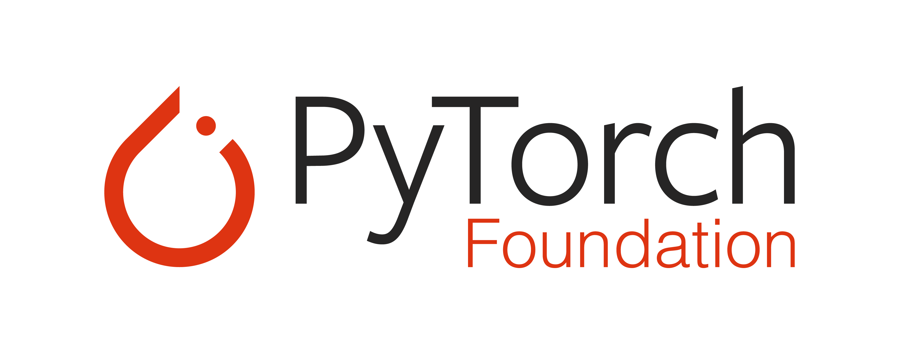</a></td>
    <td align="center"><a href="./horizontal/svg/PyTorchFLogo_Horiz_fullColor.svg">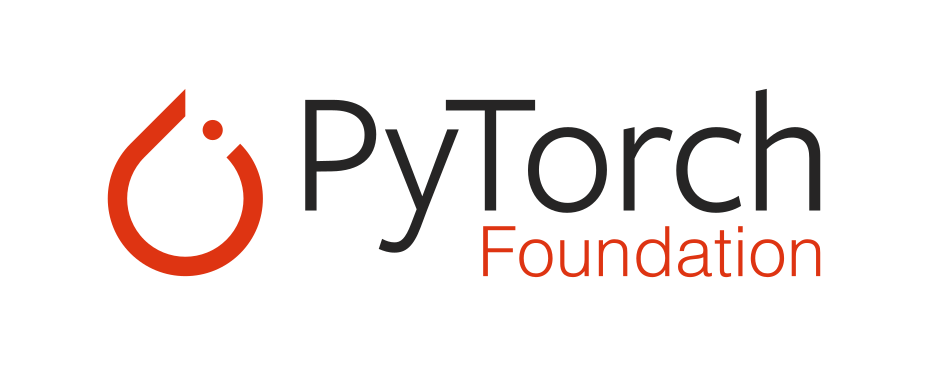</a></td>
    <td><a href="./horizontal/eps/PyTorchFLogo_Horiz_fullColor_RGB_PyTorchFLogo_Horiz_fullColor.eps">Download EPS</a></td>
  </tr>

  <tr>
    <td>Full Color White</td>
    <td bgcolor="#eaeef2" align="center"></td>
    <td bgcolor="#eaeef2" align="center"><a href="./horizontal/svg/PyTorchLogoF_Horiz_fullColorWhite.svg">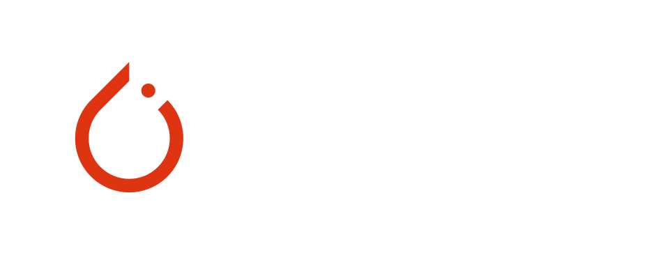</a></td>
    <td><a href="./horizontal/eps/PyTorchLogoF_Horiz_fullColorWhite_RGB_PyTorchLogoF_Horiz_fullColorWhite.eps">Download EPS</a></td>
  </tr>

  <tr>
    <td>Black</td>
    <td align="center"><a href="./horizontal/png/PyTorchFLogo_Horiz_Black.png">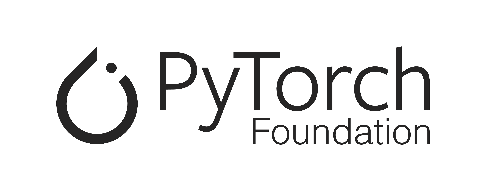</a></td>
    <td align="center"><a href="./horizontal/svg/PyTorchFLogo_Horiz_Black.svg">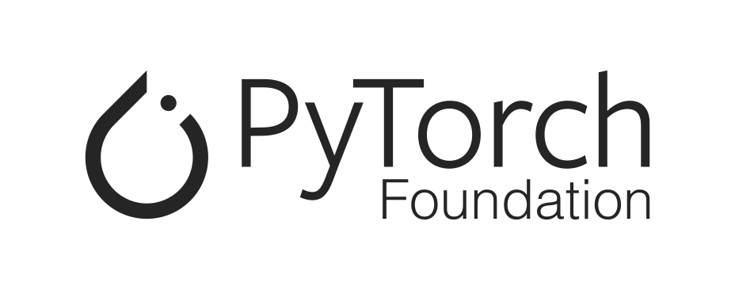</a></td>
    <td><a href="./horizontal/eps/PyTorchFLogo_Horiz_Black_RGB_PyTorchFLogo_Horiz_Black.eps">Download EPS</a></td>
  </tr>

  <tr>
    <td>White</td>
    <td bgcolor="#eaeef2" align="center"></td>
    <td bgcolor="#eaeef2" align="center"><a href="./horizontal/svg/PyTorchFLogo_Horiz_White.svg">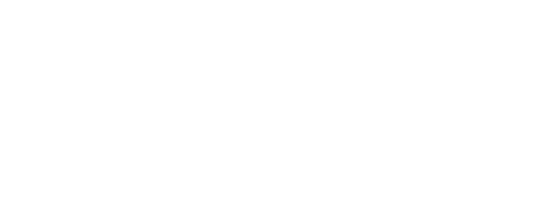</a></td>
    <td><a href="./horizontal/eps/PyTorchFLogo_Horiz_White_RGB_PyTorchFLogo_Horiz_White.eps">Download EPS</a></td>
  </tr>

  <tr>
    <th rowspan="4">Stacked</th>
    <td>Full Color</td>
    <td align="center"><a href="./stacked/png/PyTorchFLogo_Stacked_fullColor.png">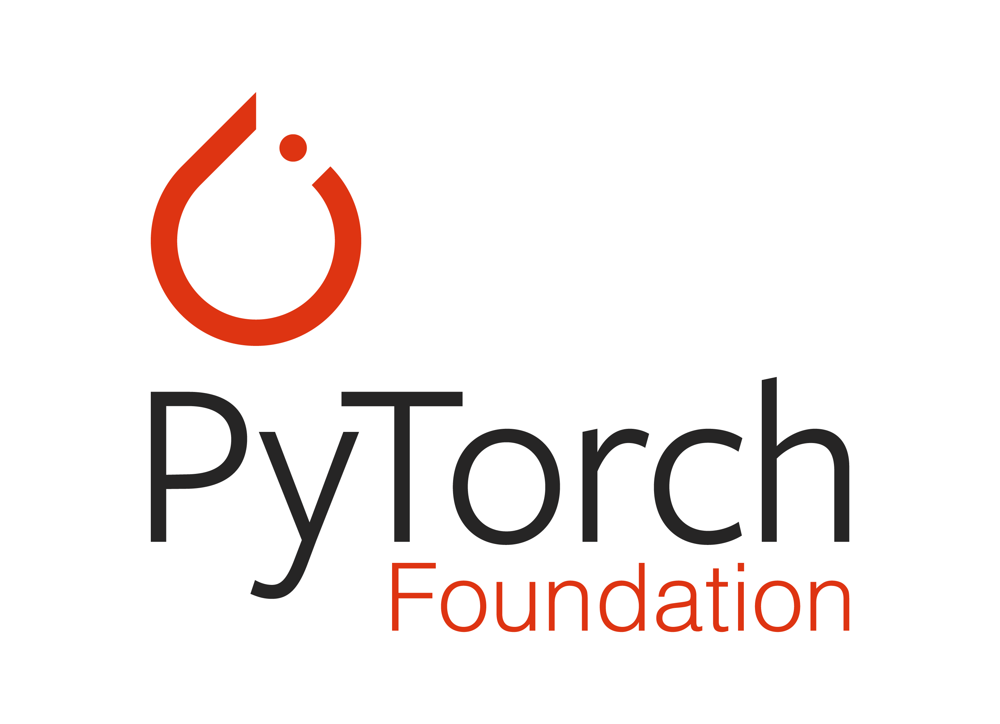</a></td>
    <td align="center"><a href="./stacked/svg/PyTorchFLogo_Stacked_fullColor.svg">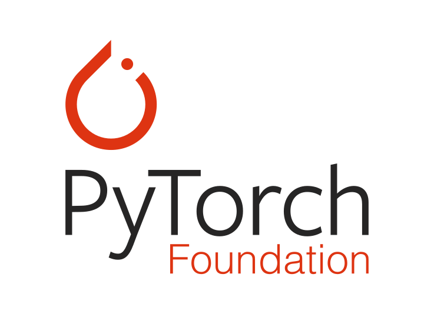</a></td>
    <td><a href="./stacked/eps/PyTorchFLogo_Stacked_fullColor_RGB_PyTorchFLogo_Stacked_fullColor.eps">Download EPS</a></td>
  </tr>

  <tr>
    <td>Full Color White</td>
    <td bgcolor="#eaeef2" align="center"><a href="./stacked/png/PyTorchFLogo_Stacked_fullColorWhite.png">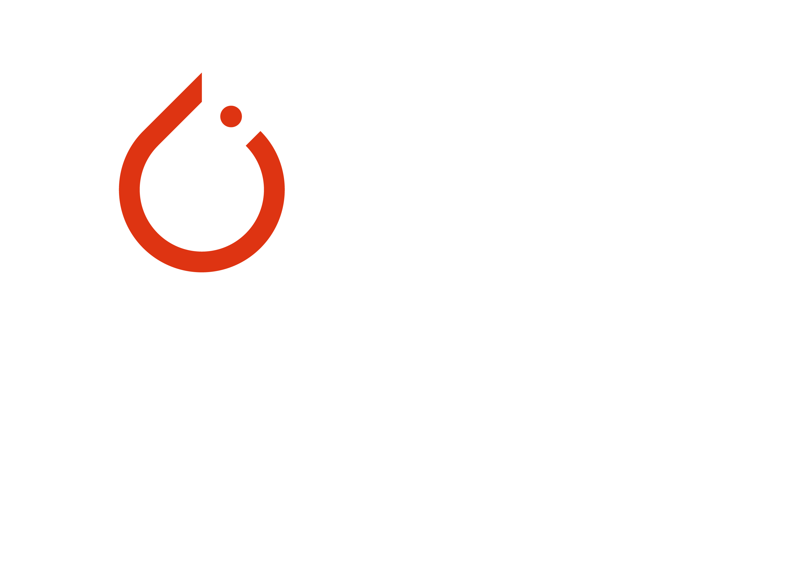</a></td>
    <td bgcolor="#eaeef2" align="center"><a href="./stacked/svg/PyTorchFLogo_Stacked_fullColorWhite.svg">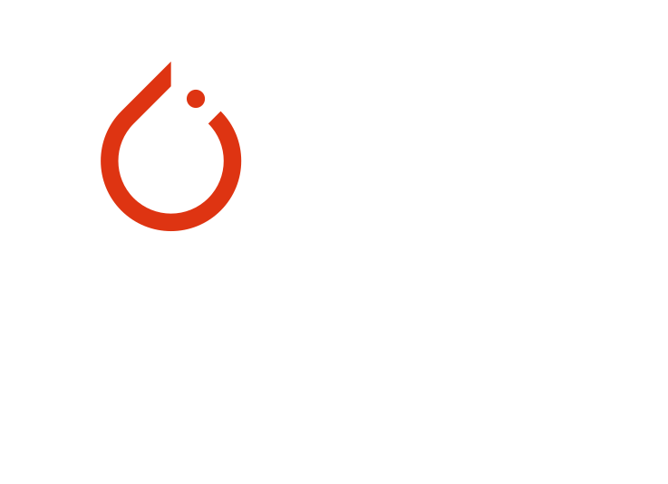</a></td>
    <td><a href="./stacked/eps/PyTorchFLogo_Stacked_fullColorWhite_RGB_PyTorchFLogo_Stacked_fullColorWhite.eps">Download EPS</a></td>
  </tr>

  <tr>
    <td>Black</td>
    <td align="center"><a href="./stacked/png/PyTorchFLogo_Stacked_Black.png">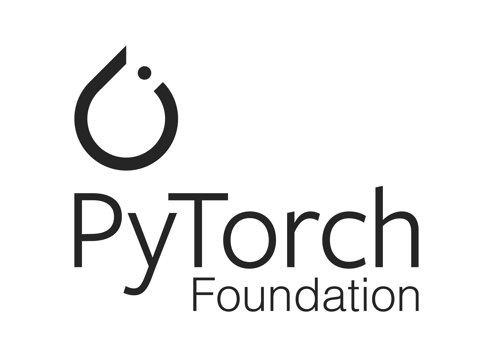</a></td>
    <td align="center"><a href="./stacked/svg/PyTorchFLogo_Stacked_Black.svg">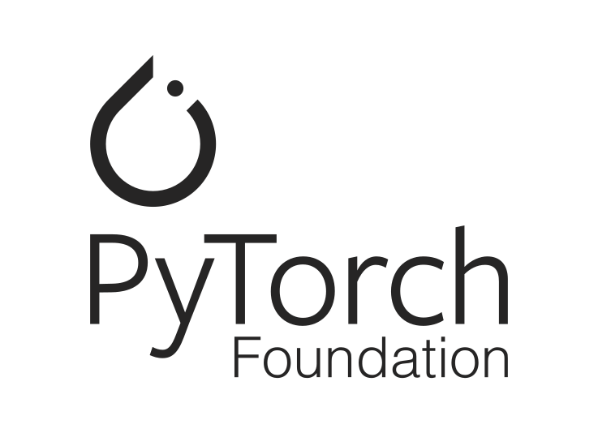</a></td>
    <td><a href="./stacked/eps/PyTorchFLogo_Stacked_Black_RGB_PyTorchFLogo_Stacked_Black.eps">Download EPS</a></td>
  </tr>

  <tr>
    <td>White</td>
    <td bgcolor="#eaeef2" align="center"></td>
    <td bgcolor="#eaeef2" align="center"><a href="./stacked/svg/PyTorchFLogo_Stacked_White.svg">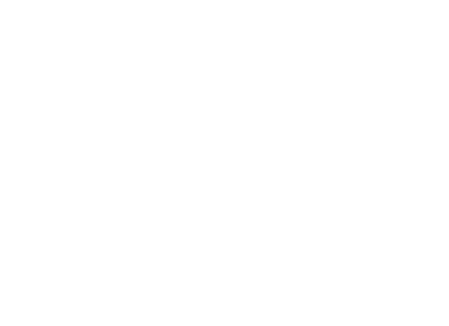</a></td>
    <td><a href="./stacked/eps/PyTorchFLogo_Stacked_White_RGB_PyTorchFLogo_Stacked_White.eps">Download EPS</a></td>
  </tr>

  <tr>
    <th rowspan="4">Vertical</th>
    <td>Full Color</td>
    <td align="center"><a href="./vertical/png/PyTorchFLogo_Vertical_fullColor.png">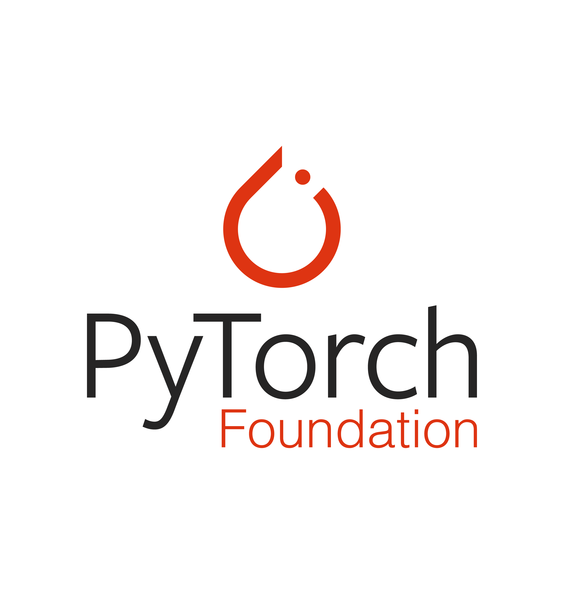</a></td>
    <td align="center"><a href="./vertical/svg/PyTorchFLogo_Vertical_fullColor.svg">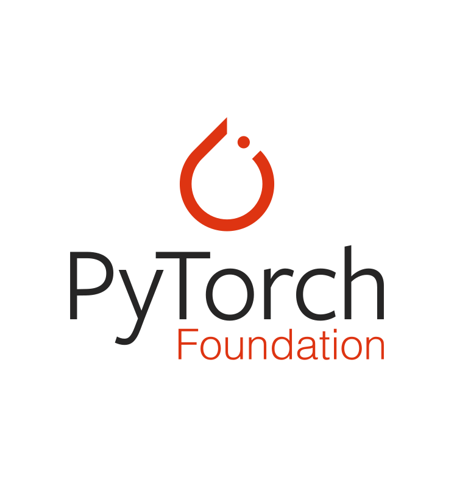</a></td>
    <td><a href="./vertical/eps/PyTorchFLogo_Vertical_fullColor_RGB_PyTorchFLogo_Vertical_fullColor.eps">Download EPS</a></td>
  </tr>

  <tr>
    <td>Full Color White</td>
    <td bgcolor="#eaeef2" align="center"><a href="./vertical/png/PyTorchFLogo_Vertical_fullColorWhite.png">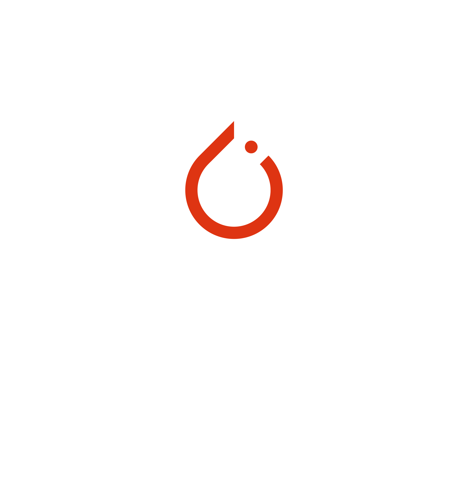</a></td>
    <td bgcolor="#eaeef2" align="center"><a href="./vertical/svg/PyTorchFLogo_Vertical_fullColorWhite.svg">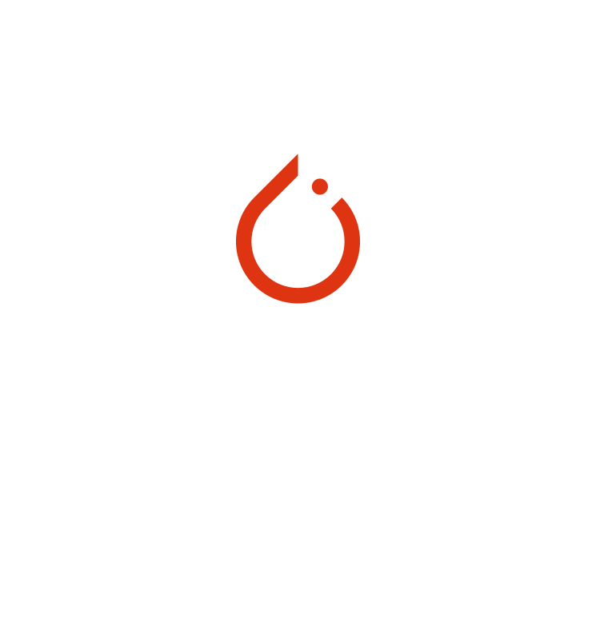</a></td>
    <td><a href="./vertical/eps/PyTorchFLogo_Vertical_fullColorWhite_RGB_PyTorchFLogo_Vertical_fullColorWhite.eps">Download EPS</a></td>
  </tr>

  <tr>
    <td>Black</td>
    <td align="center"><a href="./vertical/png/PyTorchFLogo_Vertical_Black.png">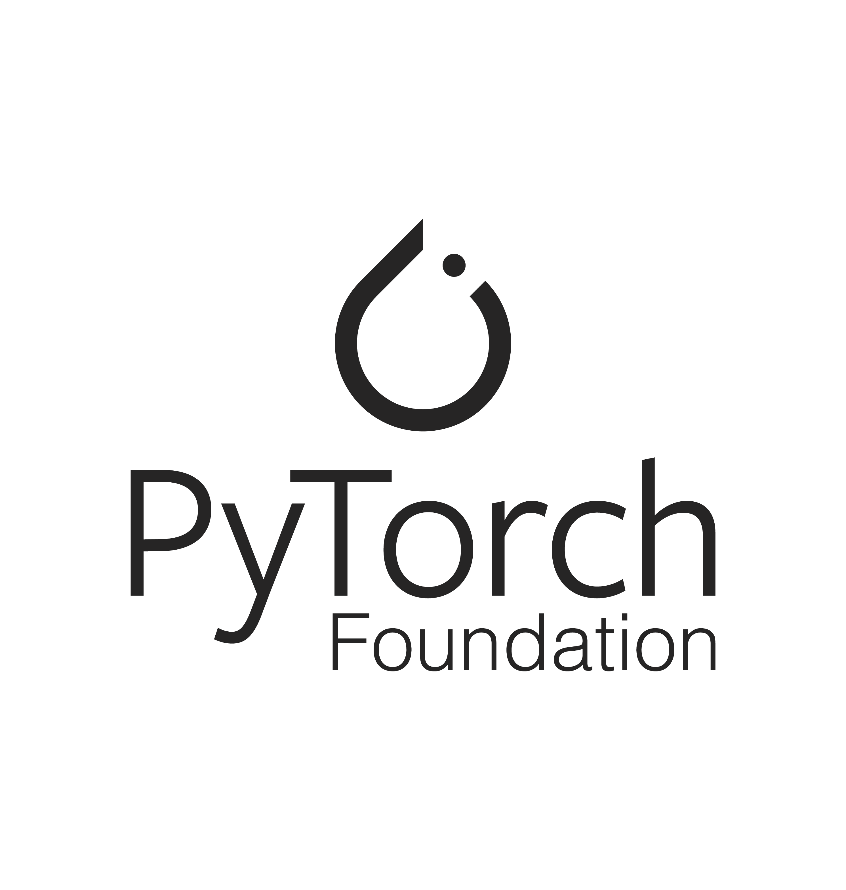</a></td>
    <td align="center"><a href="./vertical/svg/PyTorchFLogo_Vertical_Black.svg">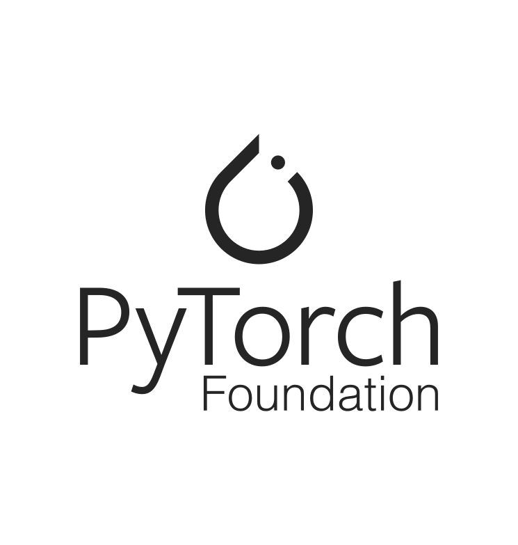</a></td>
    <td><a href="./vertical/eps/PyTorchFLogo_Vertical_Black_RGB_PyTorchFLogo_Vertical_Black.eps">Download EPS</a></td>
  </tr>

  <tr>
    <td>White</td>
    <td bgcolor="#eaeef2" align="center"></td>
    <td bgcolor="#eaeef2" align="center"></td>
    <td><a href="./vertical/eps/PyTorchFLogo_Vertical_White_RGB_PyTorchFLogo_Vertical_White.eps">Download EPS</a></td>
  </tr>

  <tr>
    <th rowspan="3">Icon</th>
    <td>Full Color</td>
    <td align="center"><a href="./icons/png/PyTorchFLogo_Icon_fullColor.png">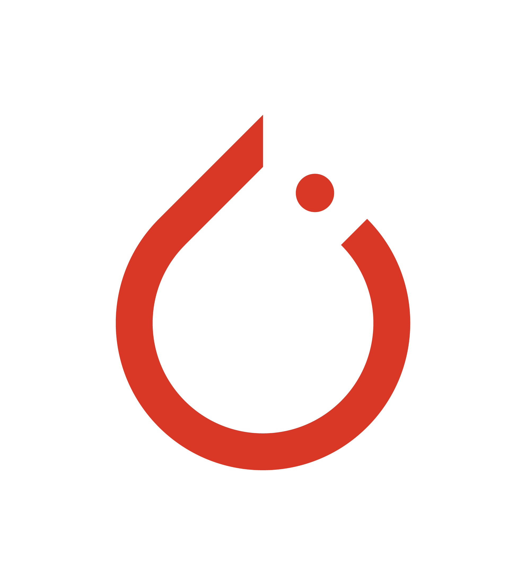</a></td>
    <td align="center"><a href="./icons/svg/PyTorchFLogo_Icon_fullColor.svg">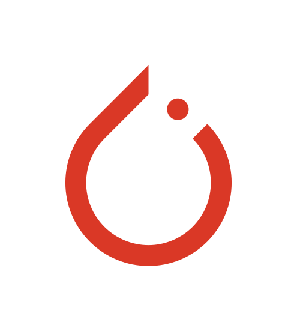</a></td>
    <td><a href="./icons/eps/PyTorchFLogo_Icon_fullColor_RGB_PyTorchFLogo_Icon_fullColor.eps">Download EPS</a></td>
  </tr>

  <tr>
    <td>Black</td>
    <td align="center"><a href="./icons/png/PyTorchFLogo_Icon_Black.png">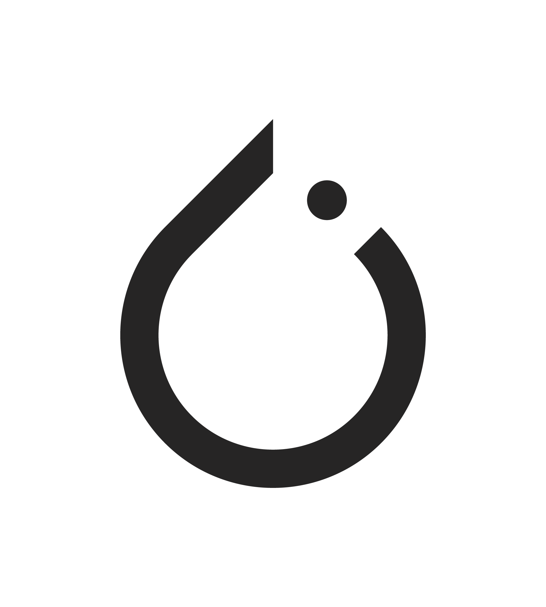</a></td>
    <td align="center"><a href="./icons/svg/PyTorchFLogo_Icon_Black.svg">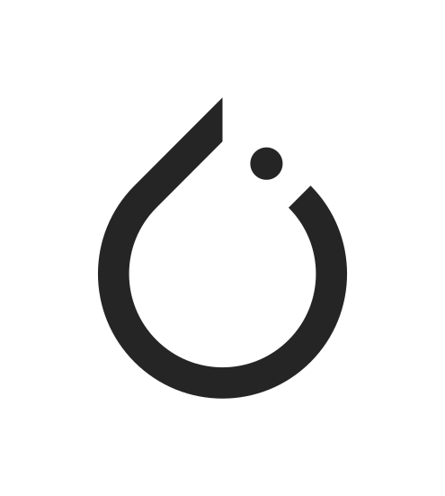</a></td>
    <td><a href="./icons/eps/PyTorchFLogo_Icon_Black_RGB_PyTorchFLogo_Icon_Black.eps">Download EPS</a></td>
  </tr>

  <tr>
    <td>White</td>
    <td bgcolor="#eaeef2" align="center"></td>
    <td bgcolor="#eaeef2" align="center"><a href="./icons/svg/PyTorchFLogo_Icon_White.svg">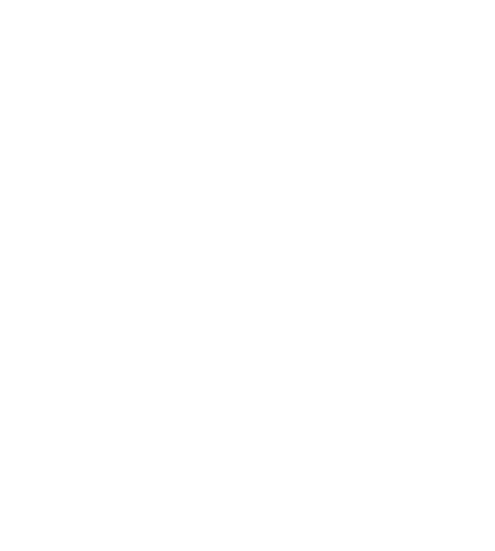</a></td>
    <td><a href="./icons/eps/PyTorchFLogo_Icon_White_RGB_PyTorchFLogo_Icon_White.eps">Download EPS</a></td>
  </tr>
</table>
