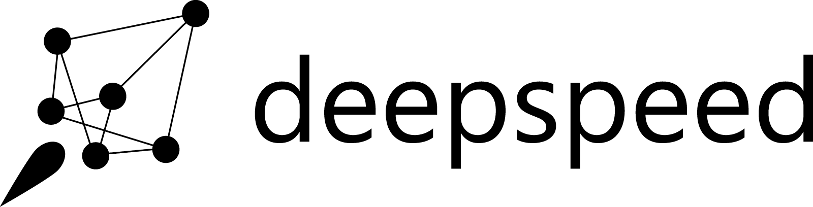
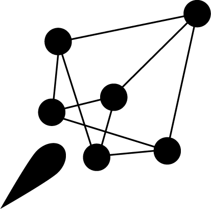

# DeepSpeed Logo

Official logo assets for DeepSpeed.

## Tips

- The horizontal version of the DeepSpeed logo is preferred when feasible.

## Logo Assets

<table>
  <tr>
    <th>Version</th>
    <th>Color</th>
    <th>PNG</th>
    <th>SVG</th>
    <th>EPS</th>
  </tr>

  <tr>
    <th rowspan="3">Horizontal</th>
    <td>Color</td>
    <td align="center"></td>
    <td align="center"></td>
    <td><a href="./horizontal/deepspeed_horizontal_color.eps">Download EPS</a></td>
  </tr>

  <tr>
    <td>Black</td>
    <td align="center"></td>
    <td align="center"></td>
    <td><a href="./horizontal/deepspeed_horizontal_black.eps">Download EPS</a></td>
  </tr>

  <tr>
    <td>White</td>
    <td bgcolor="#eaeef2" align="center"></td>
    <td bgcolor="#eaeef2" align="center"></td>
    <td><a href="./horizontal/deepspeed_horizontal_white.eps">Download EPS</a></td>
  </tr>

  <tr>
    <th rowspan="3">Stacked</th>
    <td>Color</td>
    <td align="center"></td>
    <td align="center"></td>
    <td><a href="./stacked/deepspeed_stacked_color.eps">Download EPS</a></td>
  </tr>

  <tr>
    <td>Black</td>
    <td align="center"></td>
    <td align="center"></td>
    <td><a href="./stacked/deepspeed_stacked_black.eps">Download EPS</a></td>
  </tr>

  <tr>
    <td>White</td>
    <td bgcolor="#eaeef2" align="center"></td>
    <td bgcolor="#eaeef2" align="center"></td>
    <td><a href="./stacked/deepspeed_stacked_white.eps">Download EPS</a></td>
  </tr>

  <tr>
    <th rowspan="3">Icon</th>
    <td>Color</td>
    <td align="center"></td>
    <td align="center"></td>
    <td><a href="./icon/deepspeed_icon_color.eps">Download EPS</a></td>
  </tr>

  <tr>
    <td>Black</td>
    <td align="center"></td>
    <td align="center"></td>
    <td><a href="./icon/deepspeed_icon_black.eps">Download EPS</a></td>
  </tr>

  <tr>
    <td>White</td>
    <td bgcolor="#eaeef2" align="center"></td>
    <td bgcolor="#eaeef2" align="center"></td>
    <td><a href="./icon/deepspeed_icon_white.eps">Download EPS</a></td>
  </tr>
</table>

