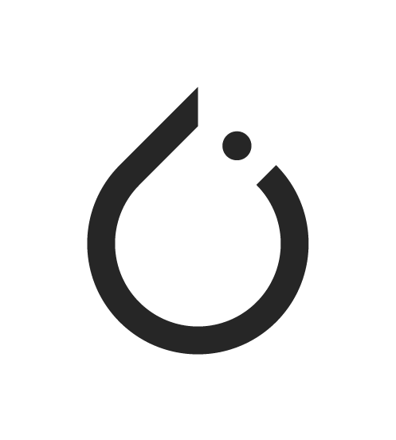

# PyTorch Logo

Official logo assets for PyTorch.

> **Tip:** The horizontal version of the PyTorch logo is preferred whenever space allows.

## Logo Assets

| Version | Color | Preview | Download |
|---------|-------|:-------:|:--------:|
| **Horizontal** | Full Color |  | [PNG](./horizontal/PyTorch%20Logo%202022_RGB_PyTorchLogo_Horiz_fullColor_RGB.png) |
| | Full Color White | 

 | [PNG](./horizontal/PyTorch%20Logo%202022_RGB_PyTorchLogo_Horiz_fullColorWhite_RGB.png) |
| | Black |  | [PNG](./horizontal/PyTorch%20Logo%202022_RGB_PyTorchLogo_Horiz_Black_RGB.png) |
| | White | 

 | [PNG](./horizontal/PyTorch%20Logo%202022_RGB_PyTorchLogo_Horiz_White_RGB.png) |
| **Stacked** | Full Color |  | [PNG](./stacked/PyTorch%20Logo%202022_RGB_PyTorchLogo_Stacked_fullColor_RGB.png) |
| | Full Color White | 

 | [PNG](./stacked/PyTorch%20Logo%202022_RGB_PyTorchLogo_Stacked_fullColorWhite_RGB.png) |
| | Black |  | [PNG](./stacked/PyTorch%20Logo%202022_RGB_PyTorchLogo_Stacked_Black_RGB.png) |
| | White | 

 | [PNG](./stacked/PyTorch%20Logo%202022_RGB_PyTorchLogo_Stacked_White_RGB.png) |
| **Vertical** | Full Color |  | [PNG](./vertical/PyTorch%20Logo%202022_RGB_PyTorchLogo_Vertical_fullColor_RGB.png) |
| | Full Color White | 

 | [PNG](./vertical/PyTorch%20Logo%202022_RGB_PyTorchLogo_Vertical_fullColorWhite_RGB.png) |
| | Black |  | [PNG](./vertical/PyTorch%20Logo%202022_RGB_PyTorchLogo_Vertical_Black_RGB.png) |
| | White | 

 | [PNG](./vertical/PyTorch%20Logo%202022_RGB_PyTorchLogo_Vertical_White_RGB.png) |
| **Icon** | Full Color |  | [PNG](./icon/PyTorchLogo_Icon_fullColor_RGB.png) |
| | Black |  | [PNG](./icon/PyTorchLogo_Icon_Black_RGB.png) |
| | White | 

 | [PNG](./icon/PyTorchLogo_Icon_White_RGB.png) |

