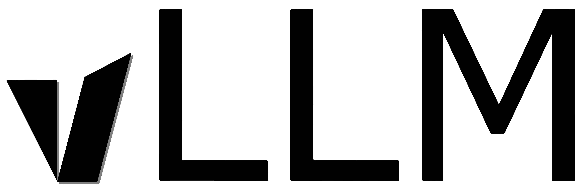
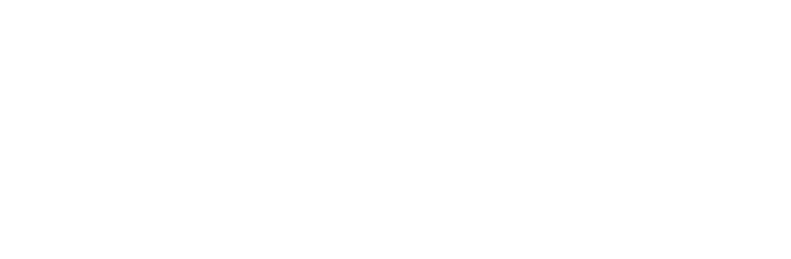

# vLLM Logo

Official logo assets for vLLM.

## Logo Assets

<table>
  <tr>
    <th>Color</th>
    <th>PNG</th>
    <th>SVG</th>
  </tr>

  <tr>
    <td>Full Color</td>
    <td align="center">
      
    </td>
    <td align="center">
      
    </td>
  </tr>

  <tr>
    <td>Black</td>
    <td align="center">
      
    </td>
    <td align="center">
      
    </td>
  </tr>

  <tr>
    <td>White</td>
    <td bgcolor="#eaeef2" align="center">
      
    </td>
    <td bgcolor="#eaeef2" align="center">
      
    </td>
  </tr>
</table>
